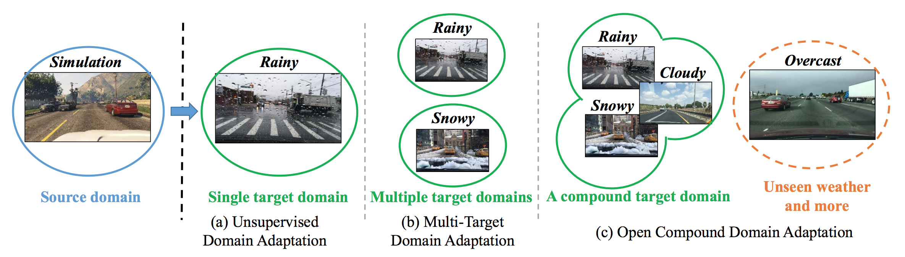
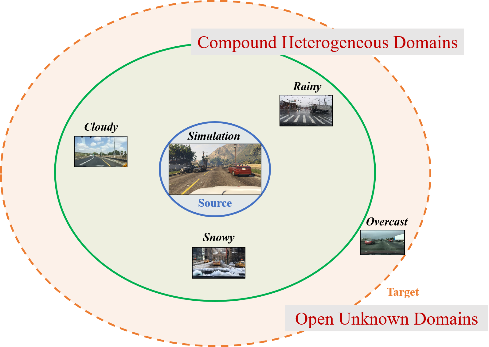
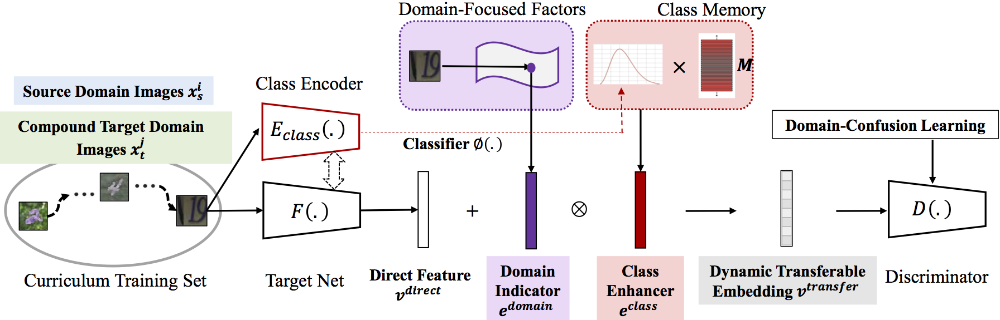

# Open Compound Domain Adaptation

[[Project]](https://liuziwei7.github.io/projects/CompoundDomain.html) [[Paper]](https://arxiv.org/abs/1909.03403) [[Demo]](https://www.youtube.com/watch?v=YcmgCCRA1qc) [[Blog]](https://bair.berkeley.edu/blog/2020/06/14/ocda/)

## Overview
`Open Compound Domain Adaptation (OCDA)` is the author's re-implementation of the compound domain adaptator described in:  
"[Open Compound Domain Adaptation](https://arxiv.org/abs/1909.03403)"   
[Ziwei Liu](https://liuziwei7.github.io/)<sup>\*</sup>,&nbsp; [Zhongqi Miao](https://github.com/zhmiao)<sup>\*</sup>,&nbsp; [Xingang Pan](https://xingangpan.github.io/),&nbsp; [Xiaohang Zhan](https://xiaohangzhan.github.io/),&nbsp; [Dahua Lin](http://dahua.me/),&nbsp; [Stella X. Yu](https://www1.icsi.berkeley.edu/~stellayu/),&nbsp; [Boqing Gong](http://boqinggong.info/)&nbsp; (CUHK & Berkeley & Google)&nbsp; 
in IEEE Conference on Computer Vision and Pattern Recognition (CVPR) 2020, **Oral Presentation**



Further information please contact [Zhongqi Miao](mailto:zhongqi.miao@berkeley.edu) and [Ziwei Liu](https://liuziwei7.github.io/).

## Requirements
* [PyTorch](https://pytorch.org/) (version >= 0.4.1)
* [scikit-learn](https://scikit-learn.org/stable/)

## Updates:
* 11/09/2020: We have uploaded C-Faces dataset. Corresponding codes will be updated shortly. Please be patient. Thank you very much!
* 06/16/2020: We have released C-Digits dataset and corresponding weights. 

## Data Preparation



[[OCDA Datasets]](https://drive.google.com/drive/folders/1_uNTF8RdvhS_sqVTnYx17hEOQpefmE2r?usp=sharing)

First, please download [C-Digits](https://drive.google.com/file/d/1ro-up5YDq1Cm9n_JaOG9pRbfPYVxcV8P/view?usp=sharing), save it to a directory, and change the dataset root in the config file accordingly.
The file contains MNIST, MNIST-M, SVHN, SVHN-bal, and SynNum. 

For C-Faces, please download [Multi-PIE](http://www.cs.cmu.edu/afs/cs/project/PIE/MultiPie/Multi-Pie/Home.html) first. Since it is a proprietary dataset, we can only privide the data list we used during training [here](https://drive.google.com/file/d/1OGPAJz5OXelzRE0kEhyU8h4cqgbewj_r/view?usp=sharing). We will update the dataset function accordingly. 


## Getting Started (Training & Testing)



### C-Digits

To run experiments for both training and evaluation on the C-Digits datasets (SVHN -> Multi):
```bash
python main.py --config ./config svhn_bal_to_multi.yaml
```
After training is completed, the same command will automatically evaluate the trained models.

### C-Faces

* We will be releasing code for C-Faces experiements very soon.

### C-Driving

* Please refer to: https://github.com/XingangPan/OCDA-Driving-Example .

## Reproduced Benchmarks and Model Zoo 

NOTE: All reproduced weights need to be decompressed into results directory:
```
OpenCompoundedDomainAdaptation-OCDA
    |--results
```

### C-Digits (Results may currently have variations.)

|  Source  |    MNIST (C)   |  MNIST-M (C)  |   USPS (C)  |  SymNum (O)  |   Avg. Acc   |      Download      |
| :------: | :------------: | :-----------: | :---------: | :----------: | :----------: | :----------------: |
|   SVHN   |      89.62     |     64.53     |    81.17    |    87.86     |    80.80     |      [model](https://drive.google.com/file/d/1RCMYC-NBwZQnPcDXIEIqn_z8EsDqv1a2/view?usp=sharing)     |

## License and Citation
The use of this software is released under [BSD-3](https://github.com/zhmiao/OpenCompoundDomainAdaptation-OCDA/blob/master/LICENSE).
```
@inproceedings{compounddomainadaptation,
  title={Open Compound Domain Adaptation},
  author={Liu, Ziwei and Miao, Zhongqi and Pan, Xingang and Zhan, Xiaohang and Lin, Dahua and Yu, Stella X. and Gong, Boqing},
  booktitle={IEEE Conference on Computer Vision and Pattern Recognition (CVPR)},
  year={2020}
}
```
